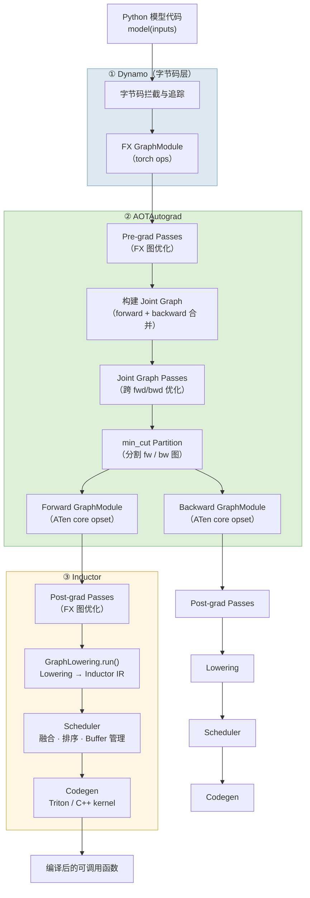
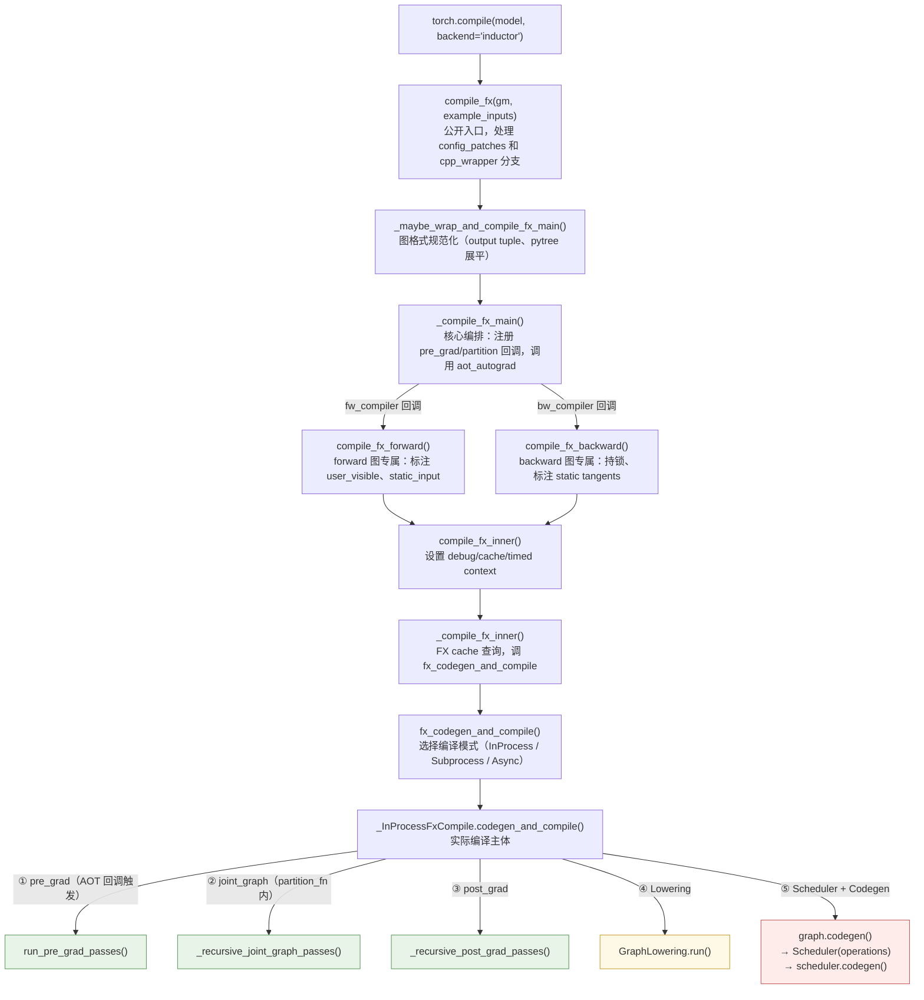
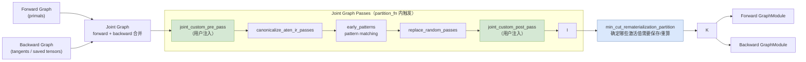
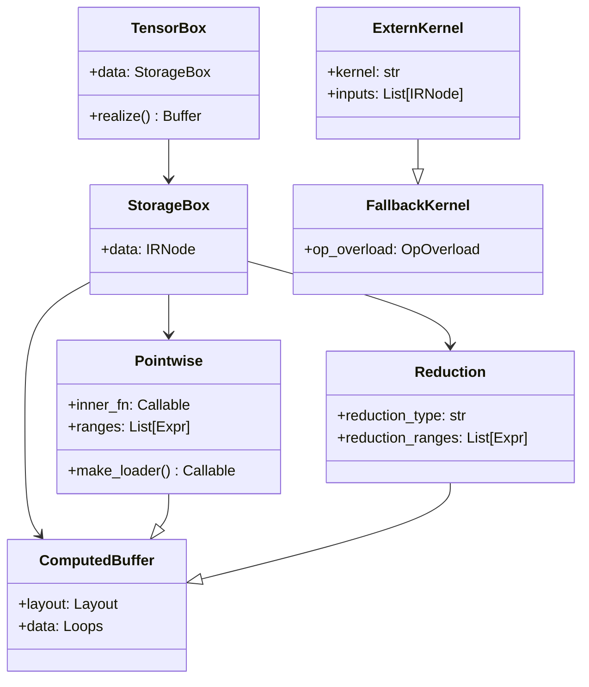
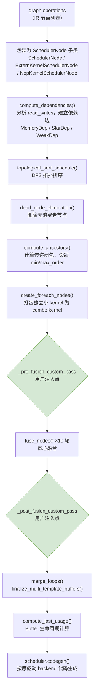
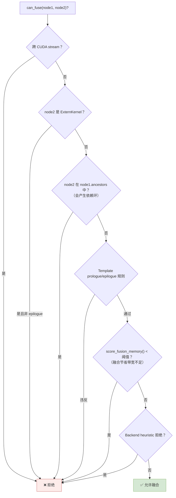
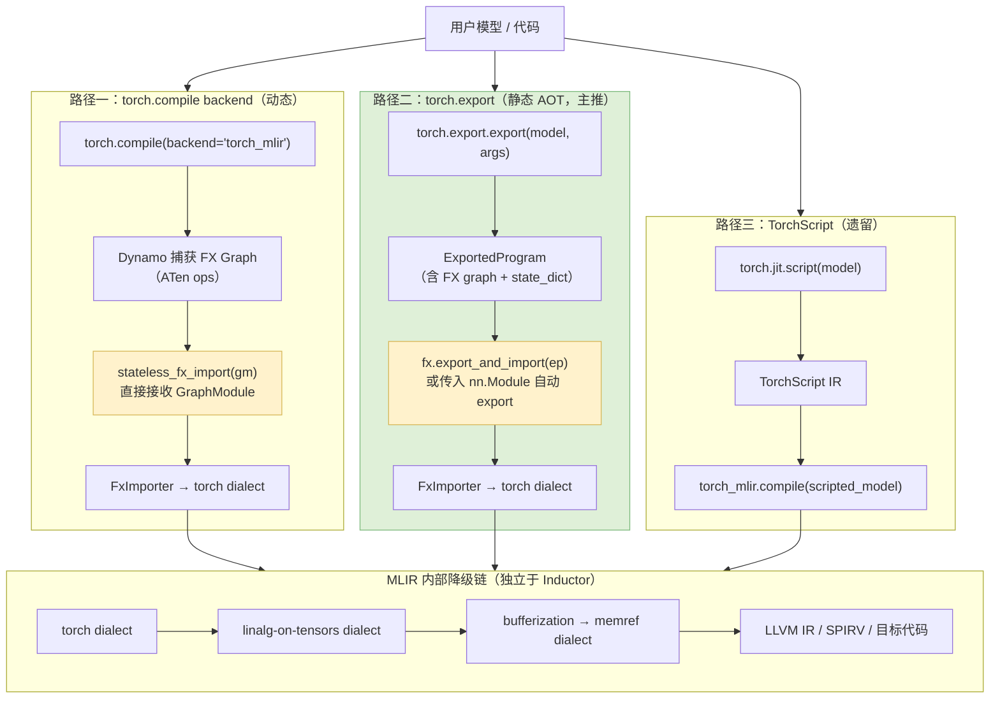

# PyTorch Inductor 图编译流程深度解析

> 本文系统梳理 `torch.compile` 背后的 Inductor 编译流水线，从 Dynamo 捕获图到最终 Triton kernel 生成，逐层拆解各阶段的机制与实现细节，并完整列举每个阶段提供的插件注入接口。适合希望深入理解 PyTorch 编译器体系、或需要在编译流程中注入自定义优化的工程师阅读。

---

## 目录

1. [整体架构概览](#1-整体架构概览)
2. [编译入口与调用层次](#2-编译入口与调用层次)
3. [各阶段详解](#3-各阶段详解)
   - [3.1 Pre-grad Pass](#31-pre-grad-pass)
   - [3.2 Joint Graph Pass 与图分割](#32-joint-graph-pass-与图分割)
   - [3.3 Post-grad Pass](#33-post-grad-pass)
   - [3.4 Lowering：FX 图到 Inductor IR](#34-loweringfx-图到-inductor-ir)
   - [3.5 Scheduler：融合、排序与代码生成](#35-scheduler融合排序与代码生成)
4. [可注入接口全景](#4-可注入接口全景)
5. [外部编译器集成：以 torch-mlir 为例](#5-外部编译器集成以-torch-mlir-为例)
6. [调试与诊断工具](#6-调试与诊断工具)
7. [总结](#7-总结)

---

## 1. 整体架构概览

`torch.compile` 是 PyTorch 2.0 引入的图编译入口，其底层由三个核心子系统串联驱动：

- **Dynamo**：Python 字节码层的追踪器，拦截并捕获计算图为 `torch.fx.GraphModule`
- **AOTAutograd**：将前向图和反向图联合处理，产出 post-autograd 的 ATen IR
- **Inductor**：PyTorch 官方的代码生成后端，负责 IR 优化、kernel 融合与 Triton/C++ 代码生成



---

## 2. 编译入口与调用层次

Inductor 侧的编译入口有多个函数，各司其职，形成清晰的职责分层。



### 各层职责一览

| 函数 | 职责 | 阶段 |
|------|------|------|
| `compile_fx` | 公开入口，config 处理，cpp_wrapper 分支 | 入口 |
| `_maybe_wrap_and_compile_fx_main` | 图格式规范化（output tuple、pytree 展平） | 预处理 |
| `_compile_fx_main` | 核心编排：注入 pre_grad/partition 回调，调用 AOTAutograd | 编排 |
| `compile_fx_forward` | forward 图专属：标注 user_visible、static_input | fw 编译 |
| `compile_fx_backward` | backward 图专属：持锁、标注 static tangents | bw 编译 |
| `compile_fx_inner` | 设置 debug/cache/timed context | 基础设施 |
| `_compile_fx_inner` | FX cache 查询，调 `fx_codegen_and_compile` | 缓存层 |
| `compile_fx_aot` | AOTInductor 专用入口（`torch.aot_compile`），最终调回 `compile_fx` | AOT 变体 |

> **关键设计**：`pre_grad` 和 `joint_graph` 两个阶段以**回调方式**注入 AOTAutograd（`pre_grad_passes=fn`、`partition_fn=fn`），其实际执行时机完全由 AOTAutograd 控制。后三个阶段（post_grad、Lowering、Scheduler）则在 Inductor 自身的 `codegen_and_compile` 闭环内直接执行。

---

## 3. 各阶段详解

### 3.1 Pre-grad Pass

**触发时机**：AOTAutograd 内部、FX cache 查询之后，构建 joint graph 之前。

**操作对象**：原始 forward 图，pre-dispatch、non-functional 的 ATen IR。

**内置 pass 链**（`torch/_inductor/fx_passes/pre_grad.py`）：

```
normalization_pass_aten
→ normalize_node_kwargs_pass
→ remove_noop_pass
→ group_batch_fusion_passes       ← 将多个独立小 GEMM 合并成 batch GEMM
→ fuse_chunk_reshape_concat_pass
→ merge_concats_pass
→ fuse_split_linear_add_pass
→ remove_reshape_pass
→ fuse_parallel_linear_pass
→ [pre_grad_custom_pass]          ← 用户自定义注入点
```

**注意**：pre-grad IR 语义不稳定，官方推荐优先使用 post-grad 阶段注入。

---

### 3.2 Joint Graph Pass 与图分割

AOTAutograd 将 forward 和 backward 合并为 joint graph 后，在分割之前运行 joint graph passes，这是唯一能跨 forward/backward 边界观察完整计算图的阶段。



**Inference 路径的特殊处理**：inference 没有 backward，`partition_fn` 不会被调用，joint graph passes 改在 `compile_fx_forward(is_inference=True)` 里直接执行。

---

### 3.3 Post-grad Pass

**触发时机**：`codegen_and_compile` 内，在 `fake_tensor_prop` 之后、`GraphLowering` 构造之前。

**操作对象**：AOTAutograd 分割出的单个 forward 或 backward 图，post-autograd functional ATen IR，**最稳定的 FX 优化阶段**。

**pass 链结构**（`torch/_inductor/fx_passes/post_grad.py`）：

```
reorder_for_locality（inference only）
→ [post_grad_custom_pre_pass]     ← 用户注入点（pattern matcher 之前）
→ group_batch_fusion_passes（post-grad）
→ remove_noop_ops / remove_assert_ops
→ pass_patterns（内置 pattern matching，含 SDPA 融合、layout 转换等）
→ post_grad_fusion_options 中配置的额外 pattern passes
→ micro_pipeline_tp / fuse_ddp_communication（分布式相关）
→ [post_grad_custom_post_pass]    ← 用户注入点（所有内置 pass 之后）
→ stable_topological_sort
→ move_constructors_to_gpu
```

---

### 3.4 Lowering：FX 图到 Inductor IR

Lowering 是 Inductor 特有的阶段，将 ATen op 节点的 FX 图转换为 Inductor 自定义的 IR 节点树。

#### Lowering 触发机制

`GraphLowering` 继承自 `torch.fx.Interpreter`，`graph.run(*example_inputs)` 遍历 FX 节点时，每个 `call_function` 节点都触发 `call_function()` 方法：

```python
# graph.py 中的优先级查找链
if target in user_lowerings:          # 优先级最高（用户自定义）
    out = user_lowerings[target](*args, **kwargs)
elif target in lowerings:             # 内置 lowering
    out = lowerings[target](*args, **kwargs)
else:                                 # 兜底：生成 FallbackKernel
    out = fallback_handler(target)(*args, **kwargs)
```

#### IR 节点层次结构



#### `register_lowering` 工作原理

以 `aten.add` 为例，走 `register_pointwise` 路径：

```python
# lowering.py 内部实现链
register_pointwise(aten.add)
  → register_lowering(aten.add)(make_pointwise(ops_wrapper("add")))
      → lowerings[aten.add] = wrapped_fn

# wrapped_fn 被调用时：
wrapped_fn(a: TensorBox, b: TensorBox)
  → make_pointwise(inner_fn)(a, b)
      → inner_fn = lambda idx: ops.add(a_loader(idx), b_loader(idx))
      → Pointwise.create(device, dtype, inner_fn, ranges)
          → ComputedBuffer → StorageBox → TensorBox  # 返回给 FX interpreter
```

关键在于 `ops.add()` 是**虚拟化**的——在 lowering 阶段它是 `OpsWrapper`（返回 `OpsValue` 符号对象），在 codegen 阶段它是 `TritonKernelOverrides`（输出 Triton 代码字符串），同一套 `inner_fn` 闭包在不同上下文下产生不同输出。

---

### 3.5 Scheduler：融合、排序与代码生成

Scheduler 是 Inductor 最核心的组件，接收 `graph.operations`（全部 IR 节点列表），完成融合决策、拓扑排序、buffer 生命周期管理，最终驱动代码生成。

#### Scheduler 初始化流程



#### 融合决策逻辑

融合分为**竖向融合**（producer → consumer）和**横向融合**（独立节点共享读取），`can_fuse()` 按以下顺序检查 gate：



融合执行时，`FusedSchedulerNode.fuse(node1, node2)` 合并两个节点的 `snodes` 列表，并重新计算合并后的 `read_writes` 和 `unmet_dependencies`。底层机制是构建 **loader chain**：内层节点的输出不落地到显存，而是作为闭包直接被外层节点的 `inner_fn` 调用。

#### SchedulerNode 类层次

| 类 | 对应 IR | 是否可融合 |
|----|---------|-----------|
| `SchedulerNode` | `ComputedBuffer` / `TemplateBuffer` | ✅ 是核心融合对象 |
| `ExternKernelSchedulerNode` | `ExternKernel`（如 cuBLAS） | ⚠️ 仅支持 epilogue 融合 |
| `NopKernelSchedulerNode` | 无实际计算 | ❌ 仅追踪依赖 |
| `FusedSchedulerNode` | 多节点合并 | ✅ 递归可再融合 |
| `ForeachKernelSchedulerNode` | 多独立节点打包 | 特殊处理 |

#### Buffer 生命周期管理

```
compute_last_usage()
    ↓
每个节点被执行后，scheduler 立即释放 node.last_usage 中的 buffer
    ↓
in-place 复用：SchedulerBuffer.can_inplace() → codegen_inplace_reuse()
    ↓
mutation 重命名链：buf0 → buf1 → buf2（通过 mutation_renames 字典追踪）
```

---

## 4. 可注入接口全景

PyTorch Inductor 在每个编译阶段都提供了标准的插件接口，统一通过 `torch._inductor.config` 配置。

```mermaid
flowchart LR
    subgraph PreGrad["Pre-grad 阶段"]
        PG1["config.pre_grad_custom_pass\nCustomGraphPass"]
    end

    subgraph JointGraph["Joint Graph 阶段"]
        JG1["config.joint_custom_pre_pass\nCustomGraphPass"]
        JG2["config.joint_custom_post_pass\nCustomGraphPass"]
        JG3["config.custom_partitioner_fn\nCustomPartitionerFn"]
    end

    subgraph PostGrad["Post-grad 阶段（推荐）"]
        PO1["config.post_grad_custom_pre_pass\nCustomGraphPass"]
        PO2["config.post_grad_custom_post_pass\nCustomGraphPass"]
    end

    subgraph Lowering["Lowering 阶段"]
        L1["register_lowering(aten_op)\n覆盖内置 lowering"]
        L2["user_lowerings[op]\n最高优先级覆盖"]
    end

    subgraph Sched["Scheduler 阶段"]
        S1["config._pre_fusion_custom_pass\nCallable[list[Node], list[Node]]"]
        S2["config._post_fusion_custom_pass\nCallable[list[Node], list[Node]]"]
    end

    subgraph Backend["设备后端"]
        B1["register_backend_for_device()\n注册完整 codegen 后端"]
    end

    PreGrad --> JointGraph --> PostGrad --> Lowering --> Sched --> Backend

    style PG1 fill:#e8f4e8,stroke:#5a9a5a
    style JG1 fill:#e8f4e8,stroke:#5a9a5a
    style JG2 fill:#e8f4e8,stroke:#5a9a5a
    style JG3 fill:#dae8fc,stroke:#6c8ebf
    style PO1 fill:#d5e8d4,stroke:#82b366
    style PO2 fill:#d5e8d4,stroke:#82b366
    style L1 fill:#fff2cc,stroke:#d6b656
    style L2 fill:#fff2cc,stroke:#d6b656
    style S1 fill:#fde8e8,stroke:#c85a5a
    style S2 fill:#fde8e8,stroke:#c85a5a
    style B1 fill:#e1d5e7,stroke:#9673a6
```



### 4.1 FX Pass 层注入（`CustomGraphPass` 接口）

所有 FX pass 层的注入点都使用同一个接口类：

```python
from torch._inductor.custom_graph_pass import CustomGraphPass, get_hash_for_files

class MyOptPass(CustomGraphPass):
    def __call__(self, graph: torch.fx.Graph) -> None:
        """在 FX graph 上做任意变换"""
        for node in graph.nodes:
            if node.op == "call_function" and node.target == torch.ops.aten.gelu.default:
                # 替换为 fast_gelu 实现
                with graph.inserting_before(node):
                    new_node = graph.call_function(fast_gelu, args=node.args)
                node.replace_all_uses_with(new_node)
                graph.erase_node(node)

    def uuid(self) -> Any:
        # 用于 FX graph cache key 计算，保证 pass 实现变更后 cache 失效
        return get_hash_for_files((__file__,))
```

**各阶段注入位置**：

```python
import torch._inductor.config as config

# Pre-grad：在所有内置 pass 之后（非 functional IR，不推荐）
config.pre_grad_custom_pass = MyPreGradPass()

# Joint graph：在 pattern matcher 之前/之后
config.joint_custom_pre_pass  = MyJointPrePass()   # fwd+bwd 合并图可见
config.joint_custom_post_pass = MyJointPostPass()

# Post-grad：推荐的主要注入点（functional ATen IR，最稳定）
config.post_grad_custom_pre_pass  = MyPostGradPrePass()  # pattern matcher 之前
config.post_grad_custom_post_pass = MyPostGradPostPass() # 所有内置 pass 之后
```

**`CustomInferenceAwareGraphPass`**：如果需要感知当前是 inference 还是 training：

```python
from torch._inductor.custom_graph_pass import CustomInferenceAwareGraphPass

class MyInferenceAwarePass(CustomInferenceAwareGraphPass):
    def __call__(self, graph: torch.fx.Graph, is_inference: bool) -> None:
        if is_inference:
            # inference 路径的特化优化
            ...
```

### 4.2 Joint Graph 分割策略替换

可以完全替换默认的 `min_cut_rematerialization_partition` 分割策略：

```python
from torch._inductor.custom_graph_pass import CustomPartitionerFn

class MyPartitioner(CustomPartitionerFn):
    def __call__(
        self,
        gm: torch.fx.GraphModule,
        joint_inputs: Sequence[object],
        **kwargs: Any,
    ) -> tuple[torch.fx.GraphModule, torch.fx.GraphModule]:
        # 自定义 forward/backward 分割逻辑
        # 返回 (fw_graph, bw_graph)
        return fw_gm, bw_gm

    def uuid(self):
        return get_hash_for_files((__file__,))

config.custom_partitioner_fn = MyPartitioner()
```

### 4.3 Lowering 层注入（`register_lowering`）

为特定 aten op 注册自定义的 IR 构建逻辑：

```python
from torch._inductor.lowering import register_lowering, lowerings
from torch._inductor import ir

# 覆盖内置 lowering（写入 lowerings 字典）
@register_lowering(torch.ops.aten.silu.default)
def my_silu_lowering(x):
    # x 是 TensorBox IR 对象，不是真实 tensor
    # 使用 make_pointwise 生成融合友好的 Pointwise 节点
    return ir.make_pointwise_fn(
        lambda val: val * ops.sigmoid(val)
    )(x)

# 最高优先级覆盖（写入 user_lowerings 字典）
from torch._inductor.lowering import user_lowerings
user_lowerings[my_custom_op] = my_lowering_fn
```

**`register_lowering` 的工作机制**：

```
register_lowering(aten_op)
    → _register_lowering(aten_op, decomp_fn)
        → lowerings[aten_op] = wrapped_fn
            → GraphLowering.call_function() 在遍历 FX 节点时查找并调用
```

### 4.4 Scheduler 层注入

在融合前后注入自定义的节点级操作（**实验性接口，API 可能变化**）：

```python
from torch._inductor.scheduler import BaseSchedulerNode

def my_pre_fusion_pass(
    nodes: list[BaseSchedulerNode],
) -> list[BaseSchedulerNode]:
    """在 fuse_nodes() 之前运行，可以重排节点顺序"""
    for node in nodes:
        # 访问节点的读写依赖信息
        print(f"{node.get_name()}: reads={node.read_writes.reads}")
    return nodes  # 必须返回节点列表

def my_post_fusion_pass(
    nodes: list[BaseSchedulerNode],
) -> list[BaseSchedulerNode]:
    """在 fuse_nodes() 之后运行，可以分析融合结果"""
    fused = [n for n in nodes if hasattr(n, 'snodes')]
    print(f"融合后共 {len(fused)} 个 FusedSchedulerNode")
    return nodes

config._pre_fusion_custom_pass  = my_pre_fusion_pass
config._post_fusion_custom_pass = my_post_fusion_pass
```

### 4.5 设备后端注册（`register_backend_for_device`）

为新硬件类型注册完整的代码生成后端，是芯片厂商扩展 Inductor 的标准方式（Intel XPU、MTIA 均使用此接口）：

```python
from torch._inductor.codegen.common import register_backend_for_device
from torch._inductor.scheduler import BaseScheduling

class MyDeviceScheduling(BaseScheduling):
    """控制 kernel 融合判断和 kernel 代码生成"""

    def can_fuse_vertical(self, node1, node2) -> bool:
        # 自定义融合规则
        ...

    def codegen_node(self, node):
        # 生成目标设备的 kernel 代码
        ...

    def codegen_sync(self):
        # 生成设备同步代码
        ...

register_backend_for_device(
    device="my_device",
    device_scheduling=MyDeviceScheduling,
    device_wrapper_codegen=MyWrapperCodegen,     # 控制 wrapper Python/C++ 代码
    device_cpp_wrapper_codegen=MyCppWrapper,     # 可选：C++ wrapper
    device_custom_pass=MyDeviceGraphPass,        # 可选：设备专属 GraphModule pass
    device_custom_config=my_device_config,       # 可选：设备专属 config module
)
```

### 接口稳定性总结

| 阶段 | 接口 | 稳定性 | 推荐程度 |
|------|------|--------|---------|
| pre_grad | `config.pre_grad_custom_pass` | ⚠️ IR 不稳定 | 一般 |
| joint_graph | `config.joint_custom_pre/post_pass` | ✅ 稳定 | 推荐（跨 fwd/bwd 场景） |
| joint_graph | `config.custom_partitioner_fn` | ✅ 稳定 | 高级用法 |
| post_grad | `config.post_grad_custom_pre/post_pass` | ✅ 最稳定 | **首选** |
| Lowering | `register_lowering` | ✅ 稳定 | 推荐（自定义 op） |
| Lowering | `user_lowerings` 直接写入 | ✅ 稳定 | 最高优先级覆盖 |
| Scheduler | `config._pre/_post_fusion_custom_pass` | ⚠️ 原型阶段 | 谨慎使用 |
| 设备后端 | `register_backend_for_device` | ✅ 官方扩展方式 | 新设备支持 |

---

## 5. 外部编译器集成：以 torch-mlir 为例

`torch-mlir` 是将 PyTorch 计算图编译到 MLIR 生态的开源项目，提供了三条介入路径，覆盖不同的使用场景。



### 两个核心接口

**`stateless_fx_import`**（路径一，直接接收 FX graph）：

```python
# python/torch_mlir/fx.py
def stateless_fx_import(
    gm: torch.fx.GraphModule,   # 直接接收 FX GraphModule，无需 torch.export
    output_type: Union[str, OutputType] = OutputType.RAW,
    model_name: str = "main",
    ...
) -> MlirModule: ...

# 与 torch.compile 后端集成
@register_backend
def torch_mlir_backend(gm: torch.fx.GraphModule, example_inputs):
    mlir_module = fx.stateless_fx_import(gm, output_type=OutputType.LINALG_ON_TENSORS)
    return mlir_pipeline.compile(mlir_module)
```

> "stateless" 意指图中不含 `get_attr` 节点引用外部参数，Dynamo 捕获的图天然满足此条件（params 已作为输入节点存在）。

**`export_and_import`**（路径二，接收 `nn.Module` 或 `ExportedProgram`）：

```python
# python/torch_mlir/fx.py
def export_and_import(
    f: Union[nn.Module, ExportedProgram],  # 注意：不是 FX graph
    *args,
    output_type: Union[str, OutputType] = OutputType.RAW,
    dynamic_shapes: Optional[...] = None,
    decomposition_table: Optional[Dict] = None,
    ...
) -> MlirModule: ...

# 使用方式
ep = torch.export.export(model, (x,), dynamic_shapes={"x": {0: Dim("batch")}})
mlir_module = fx.export_and_import(ep, output_type=OutputType.TORCH)
```

当传入 `nn.Module` 时，函数内部自动调用 `torch.export.export()` 再交给 `FxImporter`；传入 `ExportedProgram` 时跳过 export 步骤。

### 与 Inductor 的本质区别

| | Inductor | torch-mlir |
|--|---------|-----------|
| 接管位置 | `torch.export` 之后，在 Inductor 内部 | `torch.export` 之后，完全绕过 Inductor |
| 优化基础设施 | FX pass + Scheduler + Triton codegen | MLIR pass manager + Linalg tiling |
| 目标硬件 | NVIDIA/AMD GPU，CPU（Triton/C++） | 任意 MLIR 后端（RISC-V、NPU、ASIC 等） |
| Kernel 语言 | Triton / OpenMP C++ | 各 MLIR 后端方言 |

---

## 6. 调试与诊断工具

Inductor 提供了一套完整的诊断体系，按使用成本从低到高：

### TORCH_LOGS：零侵入结构化日志

```bash
# 查看各阶段 FX graph 变化
TORCH_LOGS="pre_grad_graphs,post_grad_graphs" python script.py

# 查看最终生成的 Triton kernel 代码
TORCH_LOGS="output_code,kernel_code" python script.py

# 查看 Inductor IR（Scheduler 融合前后对比）
TORCH_LOGS="ir_pre_fusion,ir_post_fusion" python script.py

# 查看 Scheduler 融合决策
TORCH_LOGS="schedule,fusion" python script.py

# 查看 graph break 原因
TORCH_LOGS="graph_breaks,recompiles" python script.py

# 查看 autotuning 结果
TORCH_LOGS="autotuning" python script.py
```

### 中间值打印器（精度调试专用）

```python
# 在 kernel 执行时记录每个中间 tensor 的统计信息
import torch._inductor.config as config

# Level 1：保存所有中间 tensor 到 .pt 文件
config.debug_printing_level = 1

# Level 2：实时打印 shape/dtype/mean/min/max/std
config.debug_printing_level = 2

# Level 3：仅打印 kernel 名称
config.debug_printing_level = 3
```

### Graph 可视化

```python
# FX graph 可视化（需要 graphviz）
from torch.fx.passes.graph_drawer import FxGraphDrawer
drawer = FxGraphDrawer(graph_module, "my_model")
drawer.get_dot_graph().write_svg("fx_graph.svg")

# Scheduler 融合后的节点图可视化
from torch._inductor.debug import draw_buffers
draw_buffers(scheduler.nodes, draw_graph=True, fname="scheduler_graph.svg")
```

### Debug Backend 分档对比

```python
# 逐层缩小问题范围
out_eager     = torch.compile(model, backend="eager")(x)
out_aot       = torch.compile(model, backend="aot_eager")(x)
out_aot_decomp= torch.compile(model, backend="aot_eager_decomp_partition")(x)
out_inductor  = torch.compile(model, backend="inductor")(x)

# 找到精度首次出现偏差的 backend，即为问题所在层
```

### CompilerBisector：自动二分定位

```python
from torch._inductor.compiler_bisector import CompilerBisector

def test_fn():
    out = torch.compile(model, backend="inductor")(inputs)
    return not torch.allclose(out, ref_output, atol=1e-4)

bisector = CompilerBisector()
result = bisector.do_bisect(test_fn)
# BisectionResult(backend='inductor', subsystem='post_grad_passes', bisect_number=17)
# → 第 17 次 PatternMatcherPass.apply() 调用引入了精度偏差
```

### Minifier：最小化复现脚本

```bash
# 遇到编译错误时自动生成最小可复现脚本
TORCH_DYNAMO_REPRO_LEVEL=4 python script.py
```

---

## 7. 总结

### 编译阶段与数据流

```mermaid
flowchart LR
    A["Python 模型\nnn.Module"] -->|Dynamo 捕获| B["FX Graph\n(torch ops)"]
    B -->|pre_grad_passes| C["优化后 FX Graph\n(pre-autograd)"]
    C -->|AOTAutograd\njoint graph| D["Joint FX Graph\n(fwd + bwd)"]
    D -->|joint_graph_passes\n+ partition| E["分离 FX Graph\n(post-autograd ATen)"]
    E -->|post_grad_passes| F["优化后 FX Graph\n(functional ATen)"]
    F -->|GraphLowering.run| G["Inductor IR\n(TensorBox / ComputedBuffer)"]
    G -->|Scheduler\n融合 · 排序| H["FusedSchedulerNode 列表\n(融合后 kernel 拓扑)"]
    H -->|Codegen| I["Triton / C++ kernel\n + Python wrapper"]

    style A fill:#f5f5f5
    style B fill:#dae8fc,stroke:#6c8ebf
    style C fill:#dae8fc,stroke:#6c8ebf
    style D fill:#d5e8d4,stroke:#82b366
    style E fill:#d5e8d4,stroke:#82b366
    style F fill:#d5e8d4,stroke:#82b366
    style G fill:#fff2cc,stroke:#d6b656
    style H fill:#ffe6cc,stroke:#d79b00
    style I fill:#fde8e8,stroke:#c85a5a
```



### 关键设计原则

**1. 懒求值（Lazy Evaluation）**：Inductor IR 节点（`TensorBox`、`Pointwise` 等）是计算的**描述**而非执行，只有调用 `realize()` 时才触发实际 buffer 分配。这使得 Scheduler 可以在不执行任何计算的情况下分析和重组整个计算图。

**2. 虚拟化（Virtualization）**：`ops.add(a, b)` 这样的调用在 lowering 阶段产生 `OpsValue` 符号对象，在 codegen 阶段输出 Triton 代码字符串。同一套 `inner_fn` 闭包在不同上下文（`MockHandler`、`OpsWrapper`、`TritonKernelOverrides`）下产生不同输出，实现了 IR 定义与代码生成的解耦。

**3. 回调注入（Callback Injection）**：pre_grad 和 joint_graph 两个阶段通过回调函数注入 AOTAutograd，执行时机完全由 AOTAutograd 决定。这种设计使 Inductor 的 pass 体系与 AOTAutograd 的执行流程解耦，各自可以独立演进。

**4. 接口稳定边界**：`torch.export` 产出的 `ExportedProgram`（ATen core opset）是 PyTorch 官方承诺稳定的"编译器接口"，torch-mlir 等外部编译器选择在此边界介入，而非进入 Inductor 内部，正是因为 Inductor IR 没有稳定性保证。

---

*参考代码版本：PyTorch main branch（2025）*  
*核心文件：`torch/_inductor/compile_fx.py`、`torch/_inductor/graph.py`、`torch/_inductor/scheduler.py`、`torch/_inductor/lowering.py`、`torch/_inductor/fx_passes/`*
